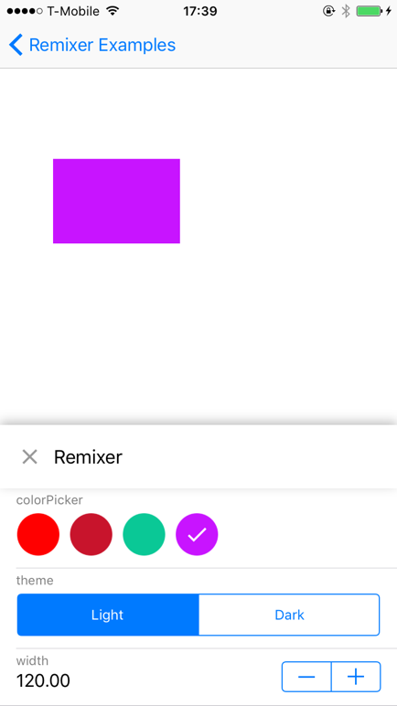

Remixer helps teams use and refine design specs by providing an abstraction for these values that is accessible and configurable from both inside and outside the app itself.

This SDK for iOS is currently in development.

**New to Remixer?** Visit our [main repo](https://github.com/material-foundation/material-remixer) to get a full description of what it is and how it works.
- - -

## Installation

### Requirements

- Xcode 7.0 or higher.
- iOS SDK version 8.0 or higher.

## Quickstart

### 1. Install CocoaPods

[CocoaPods](https://cocoapods.org/) is the easiest way to get started. If you're new to CocoaPods,
check out their [getting started documentation](https://guides.cocoapods.org/using/getting-started.html).

To install CocoaPods, run the following commands:

~~~ bash
sudo gem install cocoapods
~~~

### 2. Create Podfile

Once you've created an iOS application in Xcode you can start using Remixer for iOS.

To initialize CocoaPods in your project, run the following commands:

~~~ bash
cd your-project-directory
pod init
~~~

### 3. Edit Podfile

Once you've initialized CocoaPods, add the [Remixer iOS Pod](https://cocoapods.org/pods/Remixer)
to your target in your Podfile:

~~~ ruby
target "MyApp" do
  ...
  pod 'Remixer'
end
~~~

Then run the command:

~~~ bash
pod install
open your-project.xcworkspace
~~~

Now you're ready to get started in Xcode.

### 4. Add variables

Now you’re ready to add Remixer to your app! Begin by importing the Remixer header and call |attachToKeyWindow| in your AppDelegate:

~~~ objc
#import "Remixer.h"

@implementation AppDelegate

- (BOOL)application:(UIApplication *)application
    didFinishLaunchingWithOptions:(NSDictionary *)launchOptions {

  self.window = [[UIWindow alloc] initWithFrame:[[UIScreen mainScreen] bounds]];
  self.window.rootViewController = [[UIViewController alloc] init];
  [self.window makeKeyAndVisible];
  
  // Let Remixer know that it can attach to the window you just created
  [RMXRemixer attachToKeyWindow];

  return YES;
}

// OPTIONAL: Make sure you propagate these two events if you're using the Remote Controllers / Firebase option
- (void)applicationDidBecomeActive:(UIApplication *)application {
  [RMXRemixer applicationDidBecomeActive];
}

- (void)applicationWillResignActive:(UIApplication *)application {
  [RMXRemixer applicationWillResignActive];
}

@end
~~~

Now you can add Remixer variables in your view controllers as follows:

~~~ objc
#import "Remixer.h"

@implementation ExampleViewController {
  UIView *_box;
  RMXColorVariable *_bgColorVariable;
}

- (void)viewWillAppear {
  // IMPORTANT: Create a weak reference to self to be used inside of the update block
  __weak ExampleViewController *weakSelf = self;
  // Add a color variable to control the background color of the box.  
  _bgColorVariable =
      [RMXColorVariable
          colorVariableWithKey:@"boxBgColor"
                  defaultValue:_box.backgroundColor
               limitedToValues:nil
                   updateBlock:^(RMXColorVariable *variable, UIColor *selectedValue) {
                     weakSelf.box.backgroundColor = selectedValue;
                   }];
}

- (void)viewWillDisappear {
  // This is optional but it will make sure the variable is removed from the overlay when
  // you push view controllers on top of this one.
  _bgColorVariable = nil;
}

Make sure you keep a reference to the variables you create, otherwise they will get removed automatically.
~~~

### 5. Refine their values

Run the app and swipe up with 3 fingers (or 2 if you're using the simulator). This will trigger the Remixer overlay. From here you can see the variables your app is using, and refine their values.

## Example App

- [Objective-C example app](examples/objc)

## State of development

Visit our [State of Development](https://github.com/material-foundation/material-remixer/wiki/State-of-Development) wiki for the current roadmap and status of development for each platform.

## Other Repositories

The main Remixer GitHub repo for documentation, project tracking, and general information:
- [Remixer docs](https://github.com/material-foundation/material-remixer)

Other platform specific libraries and tools can be found in the following GitHub repos:

- [Android](https://github.com/material-foundation/material-remixer-android) - Remixer for Android.
- [Web](https://github.com/material-foundation/material-remixer-web) - Remixer for Web.
- [Web Remote](https://github.com/material-foundation/material-remixer-remote-web) - Remixer web remote controller for all platforms.

## Is material-foundation affiliated with Google?

Yes, the [material-foundation](https://github.com/material-foundation) organization is one of Google's new homes for tools and frameworks related to our [Material Design](https://material.io) system. Please check out our blog post [Design is Never Done](https://design.google.com/articles/design-is-never-done/) for more information regarding Material Design and how Remixer integrates with the system.

## Contributing

We gladly welcome contributions! If you have found a bug, have questions, or wish to contribute, please follow our [Contributing Guidelines](https://github.com/material-foundation/material-remixer-ios/blob/develop/CONTRIBUTING.md).

## License

© Google, 2016. Licensed under an [Apache-2](https://github.com/material-foundation/material-remixer-ios/blob/develop/LICENSE) license.
