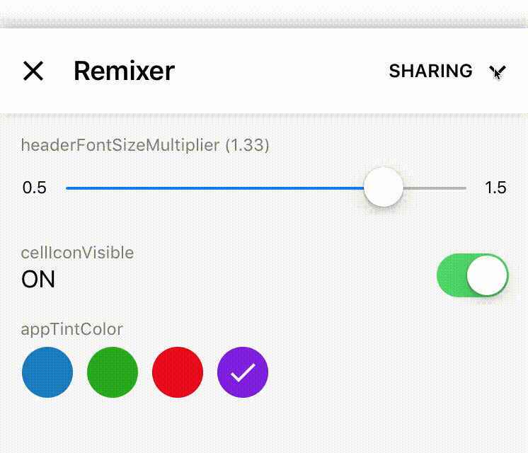

# Configuring the Firebase Remote Controller

There are three steps to being able to use the Firebase Remote Controller with Remixer for iOS:

1. Install the Firebase Remote Controller on a Firebase Instance.
2. Get your Firebase credentials
3. Set up Remixer to use the Firebase Remote Controller.

## Step 1: Install Remote Controller on Firebase

This is out of the scope of this document, as it is properly documented [in the remote's repo](https://www.github.com/material-foundation/material-remixer-remote-web).

## Step 2: Get your Firebase credentials

- Go to your [Firebase console](https://console.firebase.google.com) and click on the Firebase App where you have uploaded the Remixer Remote Controller.
- Click _Add another app_ and follow the instructions (you can reuse an already registered app if that is appropriate).
- After you finish that flow you'll be able download your credentials in a `GoogleService-info.plist` file. Import that file into your project at the root level.

More detail can be found in [the Firebase documentation](https://firebase.google.com/docs/ios/setup#manually_add_firebase).

## Step 3: 
Use `pod 'Remixer/Firebase'` in your Podfile. If you're already using Remixer you need to replace `pod 'Remixer'` with this.

That's it! Remixer is now ready to start communicating with Remote Controllers.

